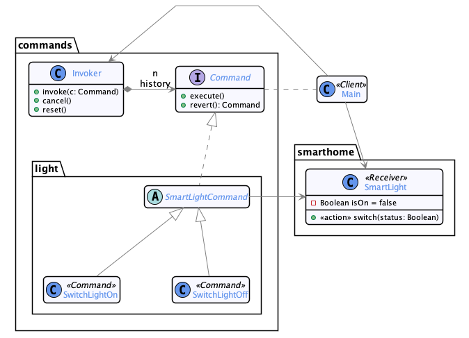

# Commande

  * Famille : Comportement

## Description du patron


### Structure

<div align="center">


</div>

### Comportement

<div align="center">


</div>

## Exemple

<div align="center">



</div>

### Remarques

  * Chaque élément de la _smarthome_ est pilotable avec des commandes associées;
  * Chaque commende est capable de s'annuler en produisant sa commande inverse avec l'opération `revert()`
  * L'`Invoker` maintient un historique de commandes effectuées pour pouvoir réinitialiser le système
    * Il suffit de rejouer toutes les commandes inverses dans l'ordre inverse d'arrivée
  * On définit une _macro-commande_ pour passer l'amphithéatre en mode "présentation"
    * Une meilleure conception serait de composer le patron _Composite_ avec le patron _Commande_ pour gérer cela.


### Démonstration

  * Pour compiler le code :
    * `lucifer:command mosser$ mvn -q clean package`
  * Pour exécuter la démonstration :
    * `lucifer:command mosser$ mvn -q exec:java`

### Code

```java
public static void main(String[] args) {

  Invoker remote = new Invoker();

  System.out.println("Piloting Smart lights");
  remote.invoke(new SwitchLightOn(Classroom.frontLight));
  remote.invoke(new SwitchLightOn(Classroom.backLight));

  System.out.println("Cancelling last command");
  remote.cancel();

  System.out.println("Switching into presenter mode");
  (new PresenterMode()).run(remote);

  System.out.println("Switching back to initial state");
  remote.reset();

}
```

### Trace

```
Piloting Smart lights
  commands.light.SwitchLightOn
  commands.light.SwitchLightOn
Cancelling last command
** Cancelling   commands.light.SwitchLightOn
  commands.light.SwitchLightOff
Switching into presenter mode
  commands.door.CloseDoor
  commands.door.CloseDoor
  commands.screen.DisplayScreen
  commands.projector.StartProjector
  commands.light.SwitchLightOff
Switching back to initial state
** Cancelling all commands
  commands.light.SwitchLightOn
  commands.projector.ShutdownProjector
  commands.screen.HideScreen
  commands.door.OpenDoor
  commands.door.OpenDoor
  commands.light.SwitchLightOff
```
