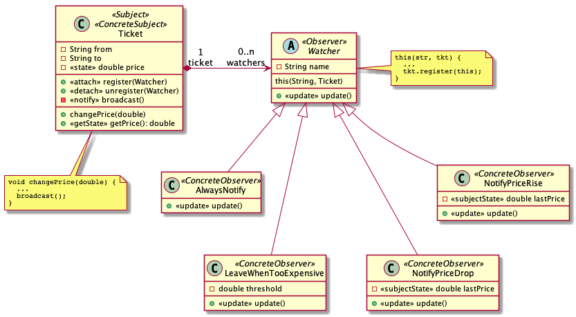

# Observer

  * Famille : Comportement

## Description du patron

> "Il est utilisé pour envoyer un signal à des modules qui jouent le rôle d'observateurs. En cas de notification, les observateurs effectuent alors l'action adéquate en fonction des informations qui parviennent depuis les modules qu'ils observent (les observables)."" (wikipedia)

### Structure

<div align="center">


</div>

### Comportement

<div align="center">


</div>

## Exemple

<div align="center">



</div>

### Remarques

  * La notification des `Watcher`s est faite de manière concurrente (`targets.parallelStream().forEach(Watcher::update);`).
    * Cela explique pourquoi les affichages peuvent être dans des ordres différents, et pourquoi les messages semblent se mélanger
  * Lors de la notification (`Ticket::broadcast`), on est obligé de cloner l'ensemble de `Watcher`s avant de le parcourir pour notifier.
    * C'est pour permettre aux `Watcher`s de prendre la décision d'arrêter d'observer le `Ticket`. Dans le cas contraire, on essaierait de modifier l'ensemble des `Watcher`s alors qu'on est toujours en train de le parcourir, ce qui leverait une exception en Java (`ConcurrentModificationException`).


### Démonstration

  * Pour compiler le code :
    * `lucifer:observer mosser$ mvn -q clean package`
  * Pour exécuter la démonstration :
    * `lucifer:observer mosser$ mvn -q exec:java`

### Code

```java
System.out.println("# Creating Flight tickets");
List<Ticket> tickets = new ArrayList<>();
tickets.add(new Ticket("YUL", "NYC", 413.45));
tickets.add(new Ticket("YUL", "BGI", 847.86));
tickets.add(new Ticket("YUL", "NCE", 655.21));
tickets.forEach(System.out::println);


System.out.println("\n# Registering Observers");
tickets.forEach((t) -> {
    new AlwaysNotify("Bob", t);
    new NotifyPriceDrop("Eve", t);
    new NotifyPriceRise("Pat", t);
    new LeaveWhenTooExpensive("Joe", t, 1.15);
});

System.out.println("\n# Running the pricing engine to mess with the tickets");
int howManyChanges = 10;
int round = 0;
Random rand = new Random();
while (round < howManyChanges) {
    Ticket t = tickets.get(rand.nextInt(tickets.size()));
    System.out.println("\n## Round "+ round + ": " + t.toString());
    double percentage = 0.75 + (rand.nextDouble()*1.25);
    t.changePrice(percentage);
    round++;
}

System.out.println("\n# End of simulation");
```

### Trace

```
# Creating Flight tickets
  Ticket { from='YUL', to='NYC', price=413.45 }
  Ticket { from='YUL', to='BGI', price=847.86 }
  Ticket { from='YUL', to='NCE', price=655.21 }

# Registering Observers
  Bob is now watching this YUL -> NYC flight [AlwaysNotify].
  Eve is now watching this YUL -> NYC flight [NotifyPriceDrop].
  Pat is now watching this YUL -> NYC flight [NotifyPriceRise].
  Joe is now watching this YUL -> NYC flight [LeaveWhenTooExpensive].
  Bob is now watching this YUL -> BGI flight [AlwaysNotify].
  Eve is now watching this YUL -> BGI flight [NotifyPriceDrop].
  Pat is now watching this YUL -> BGI flight [NotifyPriceRise].
  Joe is now watching this YUL -> BGI flight [LeaveWhenTooExpensive].
  Bob is now watching this YUL -> NCE flight [AlwaysNotify].
  Eve is now watching this YUL -> NCE flight [NotifyPriceDrop].
  Pat is now watching this YUL -> NCE flight [NotifyPriceRise].
  Joe is now watching this YUL -> NCE flight [LeaveWhenTooExpensive].

# Running the pricing engine to mess with the tickets

## Round 0:   Ticket { from='YUL', to='BGI', price=847.86 }
 * Price is increasing [1.34]!
[Joe] is receiving an update [LeaveWhenTooExpensive]
[Bob] is receiving an update [AlwaysNotify]
[Eve] is receiving an update [NotifyPriceDrop]
  -->> Sending email notification
  ->> too expensive, not interested anymore
[Pat] is receiving an update [NotifyPriceRise]
  Joe is not watching anymore the YUL -> BGI flight.
  ->> Sending email notification, price is going up

## Round 1:   Ticket { from='YUL', to='BGI', price=1136.78 }
 * Price is dropping [0.79]!
[Eve] is receiving an update [NotifyPriceDrop]
  ->> Sending email notification, price is going down
[Pat] is receiving an update [NotifyPriceRise]
[Bob] is receiving an update [AlwaysNotify]
  -->> Sending email notification

## Round 2:   Ticket { from='YUL', to='NYC', price=413.45 }
 * Price is increasing [1.12]!
[Joe] is receiving an update [LeaveWhenTooExpensive]
[Eve] is receiving an update [NotifyPriceDrop]
[Bob] is receiving an update [AlwaysNotify]
  -->> Sending email notification
[Pat] is receiving an update [NotifyPriceRise]
  ->> Sending email notification, price is going up
  ->> Sending email notification, price is still correct

## Round 3:   Ticket { from='YUL', to='NCE', price=655.21 }
 * Price is increasing [1.35]!
[Joe] is receiving an update [LeaveWhenTooExpensive]
  ->> too expensive, not interested anymore
[Bob] is receiving an update [AlwaysNotify]
  -->> Sending email notification
[Eve] is receiving an update [NotifyPriceDrop]
  Joe is not watching anymore the YUL -> NCE flight.
[Pat] is receiving an update [NotifyPriceRise]
  ->> Sending email notification, price is going up

## Round 4:   Ticket { from='YUL', to='BGI', price=901.04 }
 * Price is increasing [1.66]!
[Eve] is receiving an update [NotifyPriceDrop]
[Pat] is receiving an update [NotifyPriceRise]
  ->> Sending email notification, price is going up
[Bob] is receiving an update [AlwaysNotify]
  -->> Sending email notification

## Round 5:   Ticket { from='YUL', to='BGI', price=1499.67 }
 * Price is dropping [0.97]!
[Eve] is receiving an update [NotifyPriceDrop]
  ->> Sending email notification, price is going down
[Pat] is receiving an update [NotifyPriceRise]
[Bob] is receiving an update [AlwaysNotify]
  -->> Sending email notification

## Round 6:   Ticket { from='YUL', to='NCE', price=882.18 }
 * Price is increasing [1.28]!
[Eve] is receiving an update [NotifyPriceDrop]
[Pat] is receiving an update [NotifyPriceRise]
  ->> Sending email notification, price is going up
[Bob] is receiving an update [AlwaysNotify]
  -->> Sending email notification

## Round 7:   Ticket { from='YUL', to='BGI', price=1451.23 }
 * Price is increasing [1.74]!
[Eve] is receiving an update [NotifyPriceDrop]
[Pat] is receiving an update [NotifyPriceRise]
  ->> Sending email notification, price is going up
[Bob] is receiving an update [AlwaysNotify]
  -->> Sending email notification

## Round 8:   Ticket { from='YUL', to='NYC', price=464.68 }
 * Price is increasing [1.38]!
[Joe] is receiving an update [LeaveWhenTooExpensive]
  ->> too expensive, not interested anymore
  Joe is not watching anymore the YUL -> NYC flight.
[Eve] is receiving an update [NotifyPriceDrop]
[Bob] is receiving an update [AlwaysNotify]
  -->> Sending email notification
[Pat] is receiving an update [NotifyPriceRise]
  ->> Sending email notification, price is going up

## Round 9:   Ticket { from='YUL', to='NCE', price=1125.81 }
 * Price is increasing [1.28]!
[Eve] is receiving an update [NotifyPriceDrop]
[Pat] is receiving an update [NotifyPriceRise]
  ->> Sending email notification, price is going up
[Bob] is receiving an update [AlwaysNotify]
  -->> Sending email notification

# End of simulation
```
