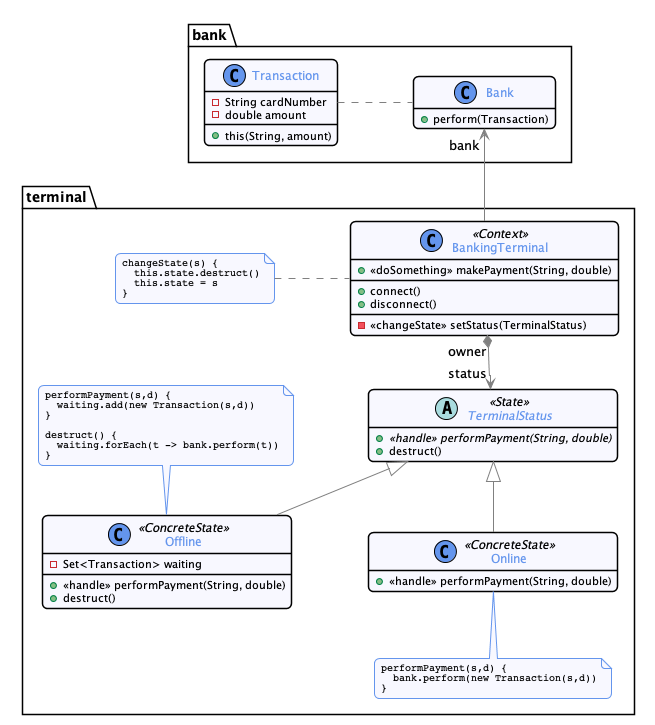

# State

  * Famille : Comportement

## Description du patron


### Structure

<div align="center">


</div>

### Comportement

<div align="center">


</div>

## Exemple

<div align="center">



</div>

## Démonstration

  * Pour compiler le code :
    * `lucifer:state mosser$ mvn -q clean package`
  * Pour exécuter la démonstration :
    * `lucifer:state mosser$ mvn -q exec:java`

### Code

```java
terminal = new BankingTerminal();

pay("123456", 120.25);
pay("987654", 12.14);

terminal.disconnect();

pay("138965", 12.14);
pay("683524", 34.51);
pay("723349", 149.99); // <<== Rejected, too high
pay("198537", 42.00);

terminal.connect();

pay("723349", 149.99); // <<== now it's ok
```

### Trace

```
Creating Status [Online]
  Performing payment [120.25]
    >> Bank executing Transaction{cardNumber='123456', amount=120.25}
  Performing payment [12.14]
    >> Bank executing Transaction{cardNumber='987654', amount=12.14}

Destructing Status [Online]

Creating Status [Offline]
  Performing payment [12.14]
  Performing payment [34.51]
  Performing payment [149.99]
    /!\ error while processing payment /!\ 
      -->> Offline payment too risky for [149.99]
  Performing payment [42.0]

Destructing Status [Offline]
    >> Bank executing Transaction{cardNumber='138965', amount=12.14}
    >> Bank executing Transaction{cardNumber='198537', amount=42.0}
    >> Bank executing Transaction{cardNumber='683524', amount=34.51}

Creating Status [Online]
  Performing payment [149.99]
    >> Bank executing Transaction{cardNumber='723349', amount=149.99}
```
