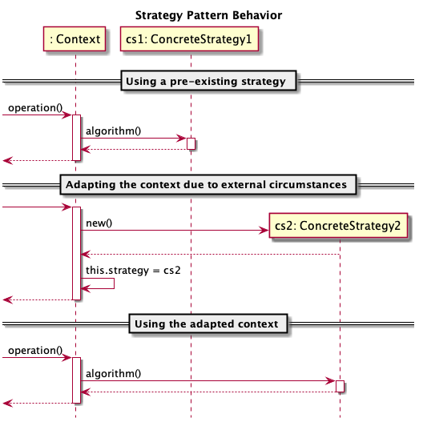

# Strategy

  * Famille : Comportement

## Description du patron 

### Structure

<div align="center">


</div>

### Comportement

<div align="center">



</div>

## Exemple

<div align="center">


</div>

## Démonstration

  * Pour compiler le code : 
    * `lucifer:strategy mosser$ mvn -q clean package`
  * Pour exécuter la démonstration :
    * `lucifer:strategy mosser$ mvn -q exec:java`

### Code

```java
List<Integer> data = Arrays.asList(1,2,3,4,5,6,7,8,9,10);

System.out.println("## Building a Recommendation Engine");
RecommendationEngine engine = new RecommendationEngine();

System.out.println("## Asking the engine to recommend a price");
System.out.println("  ==> "+ engine.recommend(data));

System.out.println("## Changing the recommendation strategy");
engine.changeComparisonMode(new ClosestToAverage());

System.out.println("## Asking the engine to recommend a price");
System.out.println("  ==> "+ engine.recommend(data));
```

### Trace

```
## Building a Recommendation Engine
## Asking the engine to recommend a price
  ==> 1
## Changing the recommendation strategy
## Asking the engine to recommend a price
  ==> 5
```