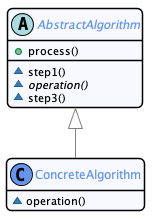
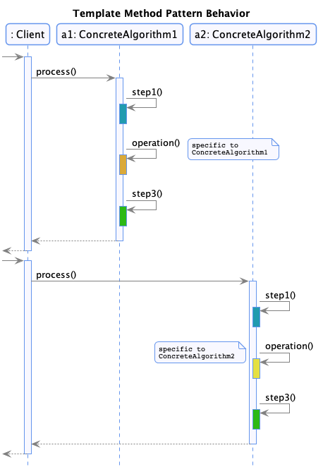
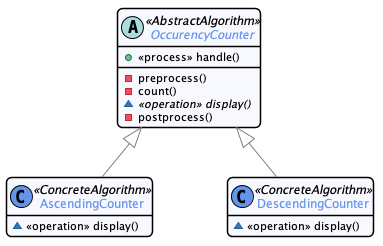

# Template Method

  * Famille : Comportement

## Description du patron


### Structure

<div align="center">



</div>

### Comportement

<div align="center">



</div>

## Exemple

<div align="center">



</div>

## Démonstration

  * Pour compiler le code :
    * `lucifer:template_method mosser$ mvn -q clean package`
  * Pour exécuter la démonstration :
    * `lucifer:template_method mosser$ mvn -q exec:java`

### Code

```java
String text = "Lorem ipsum dolor sit amet, consectetur adipiscing elit."
  + "Maecenas malesuada diam felis, ut consectetur tellus egestas sit amet."
  + "Ut porttitor augue quis felis sollicitudin posuere.";

System.out.println("\n# Counting word occurencies using an ASC counter");
OccurencyCounter asc = new AscendingCounter(text);
asc.handle();

System.out.println("\n# Counting word occurencies using a DSC counter");
OccurencyCounter dsc = new DescendingCounter(text);
dsc.handle();
```

### Trace

```
# Counting word occurencies using an ASC counter
Preprocessing data
Counting word occurencies
  adipiscing=1
  egestas=1
  augue=1
  sollicitudin=1
  lorem=1
  dolor=1
  maecenas=1
  malesuada=1
  ipsum=1
  posuere=1
  tellus=1
  quis=1
  elit=1
  diam=1
  porttitor=1
  amet=2
  felis=2
  consectetur=2
  sit=2
  ut=2
Found [20] distinct words

# Counting word occurencies using a DSC counter
Preprocessing data
Counting word occurencies
  amet=2
  felis=2
  consectetur=2
  sit=2
  ut=2
  adipiscing=1
  egestas=1
  augue=1
  sollicitudin=1
  lorem=1
  dolor=1
  maecenas=1
  malesuada=1
  ipsum=1
  posuere=1
  tellus=1
  quis=1
  elit=1
  diam=1
  porttitor=1
Found [20] distinct words
```
