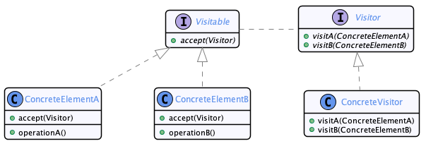
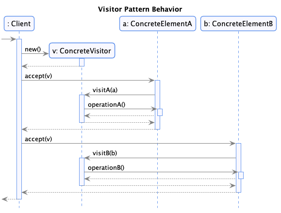
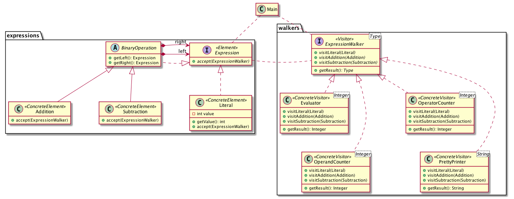

# Visitor

  * Famille : Comportement

## Description du patron


### Structure

<div align="center">



</div>

### Comportement

<div align="center">



</div>

## Exemple

<div align="center">



</div>

## Démonstration

  * Pour compiler le code :
    * `lucifer:visitor mosser$ mvn -q clean package`
  * Pour exécuter la démonstration :
    * `lucifer:visitor mosser$ mvn -q exec:java`

### Code

```java
Expression e =
        new Addition(
                new Addition(
                        new Literal(2),
                        new Subtraction(
                                new Literal(1),
                                new Literal(5))),
                new Subtraction(
                        new Literal(4),
                        new Addition(
                                new Literal(4),
                                new Literal(5))));


PrettyPrinter printer = new PrettyPrinter();
e.accept(printer);
System.out.println("Expression: " + printer.getResult());

OperandCounter opc = new OperandCounter();
e.accept(opc);
System.out.println("  #Operands =  " + opc.getResult());

OperatorCounter ops = new OperatorCounter();
e.accept(ops);
System.out.println("  #Operators =  " + ops.getResult());

Evaluator eval = new Evaluator();
e.accept(eval);
System.out.println("Value =  " + eval.getResult());
```

### Trace

```
Expression: ((2 + (1 - 5)) + (4 - (4 + 5)))
  #Operands =  6
  #Operators =  5
Value =  -7
```
