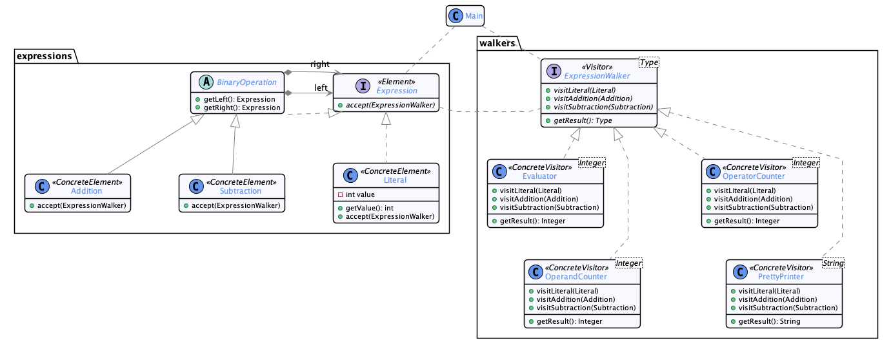

# Visitor

  * Famille : Comportement

## Description du patron


### Structure

<div align="center">


</div>

### Comportement

<div align="center">


</div>

## Exemple

<div align="center">



</div>

## Démonstration

  * Pour compiler le code :
    * `lucifer:visitor mosser$ mvn -q clean package`
  * Pour exécuter la démonstration :
    * `lucifer:visitor mosser$ mvn -q exec:java`

### Code

```java

```

### Trace

```

```
