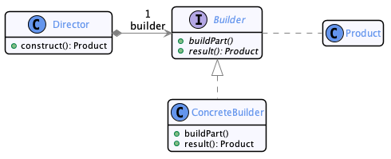
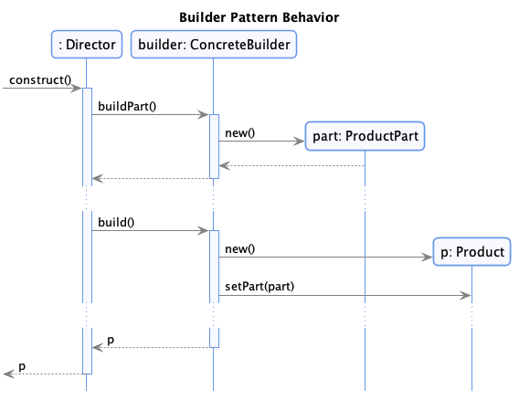
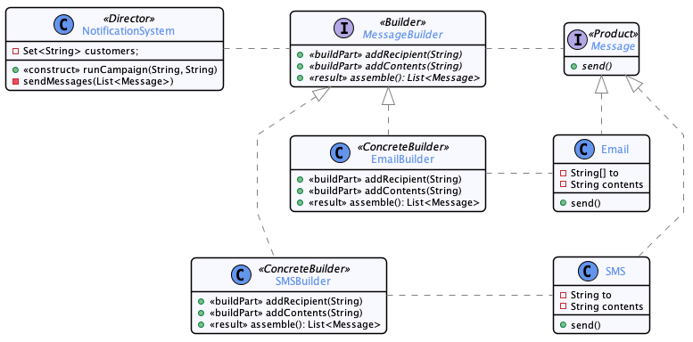

#  Builder

  * Famille : Création

## Description du patron


### Structure

<div align="center">



</div>

### Comportement

<div align="center">



</div>

## Exemple

<div align="center">



</div>

## Démonstration

  * Pour compiler le code : 
    * `lucifer:singleton mosser$ mvn -q clean package`
  * Pour exécuter la démonstration :
    * `lucifer:singleton mosser$ mvn -q exec:java`

### Code

```java
// Classe Notification system
public void runCampaign(String company, String message) {
    MessageBuilder builder = userPreferences.getOrDefault(company, new EmailBuilder());
    for(String customer: customerDatabase)
        builder.addRecipient(customer);
    builder.addContents(message);
    sendMessages(builder.assemble());
}

// Classe Main

public static void main(String[] args) {
	NotificationSystem notifier = new NotificationSystem();
	
	System.out.println("\n# Running the Netflix campaign");
	notifier.runCampaign("Netflix", "Umbrella Academy is now available!");
	
	System.out.println("\n# Running the Amazon Prime campaign");
	notifier.runCampaign("AmazonPrime", "American Gods is now available!");
	
	System.out.println("\n# Running the HBO campaign");
	notifier.runCampaign("HBO", "Game of Thrones is now available!");
	
}

```

### Trace

```
# Running the Netflix campaign
Email {to=[Bob, Eve, Alice], body='Umbrella Academy is now available!' }

# Running the Amazon Prime campaign
SMS { recipient='Bob', message='American Gods is now available!' }
SMS { recipient='Eve', message='American Gods is now available!' }
SMS { recipient='Alice', message='American Gods is now available!' }

# Running the HBO campaign
Email {to=[Bob, Eve, Alice], body='Game of Thrones is now available!' }
```