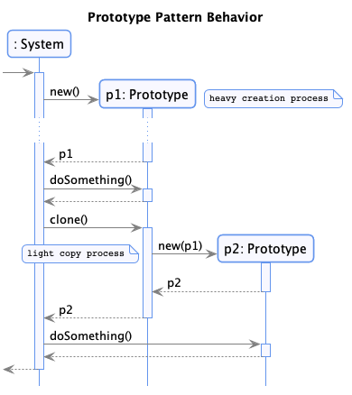
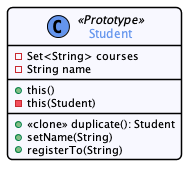

#  Prototype

  * Famille : Création

## Description du patron


### Structure

<div align="center">


</div>

### Comportement

<div align="center">



</div>

## Exemple

<div align="center">



</div>

## Démonstration

  * Pour compiler le code :
    * `lucifer:prototype mosser$ mvn -q clean package`
  * Pour exécuter la démonstration :
    * `lucifer:prototype mosser$ mvn -q exec:java`

### Code

```java
private static Set<Student> usingConstructor(){

    Set<Student> result = new HashSet<>();

    Student bob = new Student("Bob");
    bob.registerTo("INF5151");
    bob.registerTo("INF5153");
    bob.registerTo("OPT6000");
    result.add(bob);

    Student alice = new Student("Alice");
    alice.registerTo("INF5151");
    alice.registerTo("INF5153");
    alice.registerTo("OPT3000");
    result.add(alice);

    Student eve = new Student("Eve");
    eve.registerTo("INF5151");
    eve.registerTo("INF5153");
    eve.registerTo("OPT8000");
    result.add(eve);

    return result;

  }


  private static Set<Student> usingClones(){

    Set<Student> result = new HashSet<>();

    Student bob = new Student("Bob");
    bob.registerTo("INF5151");
    bob.registerTo("INF5153");

    Student alice = bob.duplicate();
    alice.setName("Alice");

    Student eve = bob.duplicate();
    eve.setName("Eve");

    bob.registerTo("OPT6000");
    result.add(bob);

    alice.registerTo("OPT3000");
    result.add(alice);

    eve.registerTo("OPT8000");
    result.add(eve);

    return result;

  }
```

### Trace

```
# Classical instantiation
  Registering [Bob] to [INF5151]
    => dbconnect ... validate ... register ... disconnect ...  <=
  Registering [Bob] to [INF5153]
    => dbconnect ... validate ... register ... disconnect ...  <=
  Registering [Bob] to [OPT6000]
    => dbconnect ... validate ... register ... disconnect ...  <=
  Registering [Alice] to [INF5151]
    => dbconnect ... validate ... register ... disconnect ...  <=
  Registering [Alice] to [INF5153]
    => dbconnect ... validate ... register ... disconnect ...  <=
  Registering [Alice] to [OPT3000]
    => dbconnect ... validate ... register ... disconnect ...  <=
  Registering [Eve] to [INF5151]
    => dbconnect ... validate ... register ... disconnect ...  <=
  Registering [Eve] to [INF5153]
    => dbconnect ... validate ... register ... disconnect ...  <=
  Registering [Eve] to [OPT8000]
    => dbconnect ... validate ... register ... disconnect ...  <=
-->> Time consumed: 5529ms

## Resulting student set
Student{name='Alice', courses=[OPT3000, INF5151, INF5153]}
Student{name='Bob', courses=[OPT6000, INF5151, INF5153]}
Student{name='Eve', courses=[OPT8000, INF5151, INF5153]}

# Using clones
  Registering [Bob] to [INF5151]
    => dbconnect ... validate ... register ... disconnect ...  <=
  Registering [Bob] to [INF5153]
    => dbconnect ... validate ... register ... disconnect ...  <=
  Cloning Student{name='Bob', courses=[INF5151, INF5153]}
  Cloning Student{name='Bob', courses=[INF5151, INF5153]}
  Registering [Bob] to [OPT6000]
    => dbconnect ... validate ... register ... disconnect ...  <=
  Registering [Alice] to [OPT3000]
    => dbconnect ... validate ... register ... disconnect ...  <=
  Registering [Eve] to [OPT8000]
    => dbconnect ... validate ... register ... disconnect ...  <=
-->> Time consumed: 3080ms

## Resulting student set
Student{name='Alice', courses=[OPT3000, INF5151, INF5153]}
Student{name='Bob', courses=[OPT6000, INF5151, INF5153]}
Student{name='Eve', courses=[OPT8000, INF5151, INF5153]}

# Are resulting sets equivalents ?
Equivalence
```
