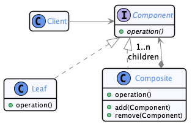
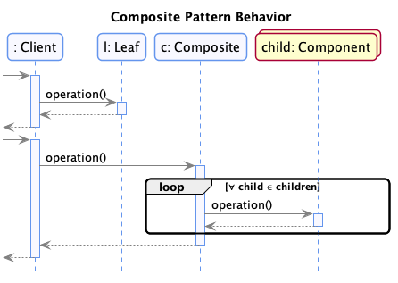
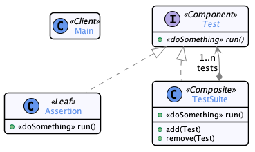

# Composite

  * Famille : Structure

## Description du patron

### Structure

<div align="center">



</div>

### Comportement

<div align="center">



</div>


## Exemple

<div align="center">



</div>


### Démonstration

  * Pour compiler le code :
    * `lucifer:composite mosser$ mvn -q clean package`
  * Pour exécuter la démonstration :
    * `lucifer:composite mosser$ mvn -q exec:java`

### Code

```java
TestSuite unit = new TestSuite("Unit tests");
unit.add(new Assertion("1st unit test"));
unit.add(new Assertion("2nd unit test"));
unit.add(new Assertion("3rd unit test"));

TestSuite accept = new TestSuite("Acceptance tests");
accept.add(new Assertion("1st scenario"));
accept.add(new Assertion("2nd scenario"));

TestSuite ext1 = new TestSuite("Integration with EXT-1");
ext1.add(new Assertion("Test with external partner #1"));
TestSuite ext2 = new TestSuite("Integration with EXT-2");
ext2.add(new Assertion("Test with external partner #2"));
TestSuite integration = new TestSuite("Integration tests");
integration.add(ext2);
integration.add(ext1);

TestSuite complete = new TestSuite("Complete test suite");
complete.add(unit);
complete.add(accept);
complete.add(integration);

System.out.println("\n# Running a single assertion");
(new Assertion("single unit test")).run();

System.out.println("\n# Running unit tests only");
unit.run();

System.out.println("\n# Running the all product suite");
complete.run();
```

### Trace

```
# Running a single assertion
  -->> Asserting single unit test

# Running unit tests only
  Running suite [ Unit tests ]
  -->> Asserting 2nd unit test
  -->> Asserting 3rd unit test
  -->> Asserting 1st unit test

# Running the all product suite
  Running suite [ Complete test suite ]
  Running suite [ Unit tests ]
  -->> Asserting 2nd unit test
  -->> Asserting 3rd unit test
  -->> Asserting 1st unit test
  Running suite [ Acceptance tests ]
  -->> Asserting 1st scenario
  -->> Asserting 2nd scenario
  Running suite [ Integration tests ]
  Running suite [ Integration with EXT-2 ]
  -->> Asserting Test with external partner #2
  Running suite [ Integration with EXT-1 ]
  -->> Asserting Test with external partner #1
```
