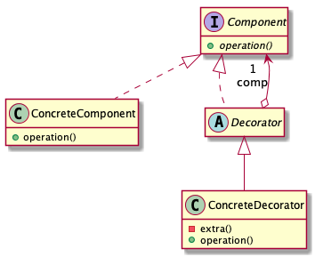
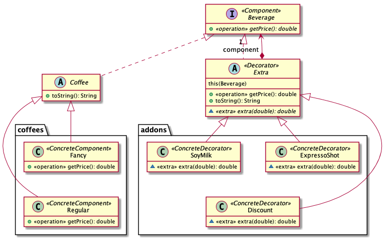

# Décorateur

  * Famille : Structure

## Description du patron

### Structure

<div align="center">



</div>

### Comportement

<div align="center">


</div>

## Exemple

<div align="center">



</div>

### Remarques

  * L'ordre d'application des décorateurs (par exemple le `Discount`) à de l'importance.
  * L'opération `toString` pourrait aussi être considérée comme décorée dans l'exemple.

### Démonstration

  * Pour compiler le code :
    * `lucifer:decorator mosser$ mvn -q clean package`
  * Pour exécuter la démonstration :
    * `lucifer:decorator mosser$ mvn -q exec:java`

### Code

```java
System.out.println("# Selling plain coffees");
displayBeverage(new Regular());
displayBeverage(new Fancy());

System.out.println("\n# Adding extras");
displayBeverage(new SoyMilk(new Regular()));
displayBeverage(new ExpressoShot(new Fancy()));
displayBeverage(new SoyMilk(new ExpressoShot(new Fancy())));
displayBeverage(new ExpressoShot(new ExpressoShot(new Regular())));

System.out.println("\n# Messing up with discounts (aka order matters)");
displayBeverage(new Discount(new Regular()));
displayBeverage(new Discount(new ExpressoShot(new Regular())));
displayBeverage(new ExpressoShot(new Discount(new Regular())));
```

### Trace

```
# Selling plain coffees
Regular: $2.00
Fancy: $3.25

# Adding extras
Regular, SoyMilk: $3.25
Fancy, ExpressoShot: $4.05
Fancy, ExpressoShot, SoyMilk: $5.30
Regular, ExpressoShot, ExpressoShot: $3.60

# Messing up with discounts (aka order matters)
Regular, Discount: $1.60
Regular, ExpressoShot, Discount: $2.24
Regular, Discount, ExpressoShot: $2.40
```
