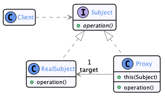
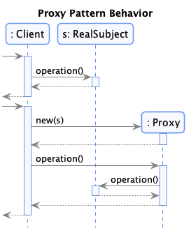

# Composite

  * Famille : Proxy

## Description du patron

### Structure

<div align="center">



</div>

### Comportement

<div align="center">



</div>


## Exemple

<div align="center">


</div>


### Démonstration

  * Pour compiler le code :
    * `lucifer:proxy mosser$ mvn -q clean package`
  * Pour exécuter la démonstration :
    * `lucifer:proxy mosser$ mvn -q exec:java`

### Code

```java
System.out.println("\n# Using the remote registry directly");
Registry remote = new RemoteRegistry();
consult(remote, "bob");
consult(remote, "bob");
consult(remote, "alice");
consult(remote, "alice");
consult(remote, "bob");

System.out.println("\n# Using a cached Registry");
Registry cached = new CachedRegistry(remote);
consult(cached, "bob");
consult(cached, "bob");
consult(cached, "alice");
consult(cached, "alice");
consult(cached, "bob");
```

### Trace

```
# Using the remote registry directly
  --- Remote Call -- Expensive
  [bob] --> [514-555-1376]
  --- Remote Call -- Expensive
  [bob] --> [514-555-1376]
  --- Remote Call -- Expensive
  [alice] --> [438-555-1492]
  --- Remote Call -- Expensive
  [alice] --> [438-555-1492]
  --- Remote Call -- Expensive
  [bob] --> [514-555-1376]

# Using a cached Registry
  --- Remote Call -- Expensive
  [bob] --> [514-555-1376]
  [bob] --> [514-555-1376]
  --- Remote Call -- Expensive
  [alice] --> [438-555-1492]
  [alice] --> [438-555-1492]
  [bob] --> [514-555-1376]
```
